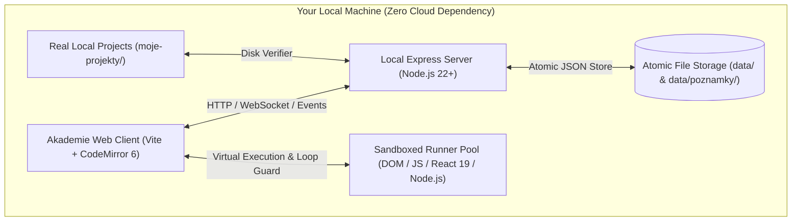

# Akademie

<p align="center">
  <strong>An interactive, local-first web development learning platform that runs entirely on your own machine.</strong>
</p>

<p align="center">
  Learn by predicting code behavior, building real projects in the browser and in VS Code, with real-time test feedback and spaced repetition.
</p>

<p align="center">
  <a href="https://nodejs.org/"></a>
  <a href="https://vite.dev/"></a>
  <a href="https://vitest.dev/"></a>
  <a href="https://playwright.dev/"></a>
  <a href="https://codemirror.net/"></a>
  <a href="https://tailwindcss.com/"></a>
  
  
  
</p>

---

## Overview

**Akademie** is a self-hosted, offline-first web development academy engineered from first principles. Unlike conventional video courses or cloud-based coding sandboxes that trap learners in simplified playgrounds, Akademie bridges the gap between structured conceptual instruction and authentic local development.

Every lesson, interactive workshop, lab, quiz, and fullscale project runs locally. Your code executes inside isolated client sandboxes or actual local Node.js child processes. Your progress, notes, and mastery metrics remain strictly on your filesystem in human-readable JSON and Markdown files.



---

## Key Features

### 1. In-Browser & Local Sandboxes
- **Multi-Runtime Isolation**: Execute pure JavaScript, responsive DOM/HTML/CSS, React 19 (compiled on-the-fly via Sucrase & Acorn), Vue 3, and full Node.js servers.
- **Node.js HTTP Playground**: Run backend servers locally, inspect live terminal stdout/stderr, and trigger requests with an integrated interactive HTTP client (method, headers, query, body).
- **Infinite Loop Protection**: Code is parsed through Acorn AST analysis and dynamically instrumented with a deterministic iteration guard, preventing runaway loops from locking the browser tab.

### 2. Step-by-Step Interactive Workshops
- **Focused Code Horizons**: Pre-filled scaffolding lets you concentrate on the current problem without breaking upstream dependencies. Prior step code automatically collapses to maintain focus.
- **Smart Diff Verification**: Assertion runners evaluate DOM mutations, computed styles, AST structures, and runtime return values.
- **Progressive Assistance**: If you hit a roadblock, the platform offers hints in graduated tiers (Concept &rarr; API Method &rarr; Syntax Pattern &rarr; Full Visual Diff).

### 3. Integrated Spaced Repetition System (SRS)
- **Built Into Daily Coding**: Concepts, quizzes, bug-fixing exercises, and self-explanation checkpoints automatically schedule into a daily review queue using adaptive intervals (1, 3, 7, 16, 35, 90 days).
- **Metacognitive Calibration**: Rate answers as *"I'm confident"* vs *"I'm guessing"*. When you are mistakenly confident, items are scheduled for immediate next-day reinforcement.

### 4. VS Code & Real Disk Integration
- **Zero Lock-In Scaffolding**: Projects scaffold directly into your physical filesystem under `moje-projekty/`.
- **Native Editor Workflow**: Write production code inside VS Code, install npm dependencies, and commit with Git.
- **Direct-from-Disk Test Verification**: Click **Check** in the browser to run automated test suites directly against your local workspace files on disk.

### 5. Instant Feedback & "Explain in Your Own Words"
- **Clear Diagnostic Error Messages**: Technical error traces are translated into friendly, actionable diagnostic guidance with jump-to-line shortcuts.
- **Self-Explanation Checkpoints**: Synthesize *why* a solution works. Compare your explanation against expert rubrics and save notes to your personal library.

### 6. Accessible Design & Themes
- **WCAG Compliant**: Light and dark themes designed with contrast ratios strictly exceeding WCAG AA/AAA standards (&ge; 4.5:1 for body copy).
- **Responsive Viewport Previews**: Toggle device viewports (Desktop, Tablet 768px, Mobile 375px) or pop out to an external browser tab to inspect using real Chrome/Firefox DevTools.

---

## Architecture & Tech Stack

Akademie adopts a modular, dependency-conscious architecture built for extreme performance, offline reliability, and extensibility.

```
┌────────────────────────────────────────────────────────────────────────┐
│                          Akademie Architecture                         │
├──────────────────────────────────┬─────────────────────────────────────┤
│  Client (client/src/)            │  Server (server/)                   │
│  - Vanilla ES Modules + Vite 8   │  - Node.js 22+ & Express 5          │
│  - CodeMirror 6 Editor & Linter  │  - Atomic JSON File Stores (store.js│
│  - Reactive Event Bus & Slots    │  - Node.js Process Harness          │
│  - Micro-component UI System     │  - Extensible Auto-loading Routes   │
├──────────────────────────────────┼─────────────────────────────────────┤
│  Runner & Sandboxing             │  Content Engine                     │
│  - Iframe Sandboxed Runner Pool  │  - Declarative Extended Markdown    │
│  - Acorn AST Loop Protection     │  - Unified Test Assertions          │
│  - Sucrase JSX / TS Compilation  │  - Headless Browser Verification    │
│  - Playwright E2E Driver         │  - Real-time Link & Anchor Indexing │
└──────────────────────────────────┴─────────────────────────────────────┘
```

### Frontend
- **Core**: Vanilla JavaScript (ES2024+) with Vite for ultra-fast HMR and lean bundle builds.
- **Code Editor**: CodeMirror 6 with syntax highlighting for HTML, CSS, JavaScript, TypeScript, and live AST-based linting.
- **Modern Styling**: Tailwind CSS v4 alongside pure CSS design tokens declared in `tokens.css`.
- **Modular Slots**: Screen, header, and workspace registries (`core/registry.js`, `core/slots.js`, `core/events.js`) enable plugins to extend the interface without mutating core views.

### Backend & Local Storage
- **Runtime**: Node.js 22+ with native ESM support.
- **Web Server**: Express 5 serving API endpoints, static assets, and local dev processes.
- **Crash-Resilient Storage**: `createJsonStore` executes atomic writes via temporary `.tmp` buffers and POSIX renames with write-queue coalescence. Corrupted stores are automatically backed up to `.broken-<timestamp>` and safely restored.

### Test Runner & Sandboxing
- **Sandboxed Runner Pool**: Test cases run in isolated, disposable iframes with custom virtualized storage (`localStorage` / `sessionStorage`) and execution timeouts.
- **Acorn AST Instrumenter**: Injects deterministic loop guards (`loop-guard.js`) into loop headers (`for`, `while`, `do...while`) using AST rewrites to prevent browser lockups.
- **External Library Engine**: Seamlessly integrates Tailwind CSS v4, GSAP, ScrollTrigger, Motion, Lenis, Three.js, React Router, and TanStack Query on demand.
- **Playwright Automation**: Orchestrates headless Chromium instances for headless verification and end-to-end regression suites.

### Content Engine
The curriculum is authored in a structured, declarative Markdown dialect that couples rich instructional prose with executable tests:
- `:::live` — Interactive code sandboxes with dynamic controls (sliders, toggles) and live CSS emission.
- `:::check` / `:::check pretest` — Knowledge checkpoint questions and formative pre-tests.
- `:::explain` — Self-explanation synthesis prompts with automated rubric comparison.
- `:::memory` — Step-by-step memory model diagrams tracking references and variable allocations.
- `:::compare` — Side-by-side behavioral comparisons.
- `# --hints--` — Executable test assertions validating learner solutions.
- `# --help--` / `## --tip--` — Tiered hints and contextual references.
- `# --seed--` / `## --file--` — Starter files with editable zones demarcated by `--edit--`.
- `# --solution--` — Reference solutions used for diff generation and automated regression verification.

#### Curriculum Authoring Example:
````markdown
# --description--
Add a flex container to center child elements horizontally and vertically.

# --hints--
The `.container` element must declare `display: flex`.
```js
assert.equal(getComputedStyle(document.querySelector('.container')).display, 'flex', '.container must use display: flex');
```

The container must center items along both axes.
```js
const style = getComputedStyle(document.querySelector('.container'));
assert.equal(style.justifyContent, 'center', 'justify-content should be center');
assert.equal(style.alignItems, 'center', 'align-items should be center');
```

# --help--
## --tip--
Review the [Flexbox Alignment Guide](see:css-flexbox/uvod-do-flexboxu#flex-alignment).

## --tip--
Use `justify-content: center` for the main axis and `align-items: center` for the cross axis.

# --seed--
## --file-- styles.css
```css
.container {
  min-height: 100vh;
--edit--

--edit--
}
```

# --solution--
## --file-- styles.css
```css
.container {
  min-height: 100vh;
  display: flex;
  justify-content: center;
  align-items: center;
}
```
````

---

## Getting Started

### Prerequisites
- **Node.js 22.0.0 or higher** (ESM, `--test` runner, and modern web platform APIs).
- **npm** (bundled with Node.js).
- **Git** and **VS Code** (recommended for local projects).

### Quick Start in 60 Seconds

1. **Clone or navigate to the repository:**
   ```bash
   git clone https://github.com/your-username/akademie.git
   cd akademie
   ```

2. **Launch the application:**
   ```bash
   ./start.sh
   ```
   *The startup script will automatically install dependencies, build the client bundle via Vite if needed, prepare vendor libraries, and start the local HTTP server.*

3. **Open in your browser:**
   Navigate to [http://localhost:4300](http://localhost:4300).

4. **Shutting down:**
   Press `Ctrl+C` in your terminal. All progress, metrics, and scratchpads remain safely stored in the `data/` directory.

> [!TIP]
> **Need a custom port?**
> Launch with the `PORT` environment variable:
> ```bash
> PORT=4301 ./start.sh
> ```

---

## Directory Structure

```
akademie/
├── client/                     # Frontend web application
│   ├── index.html              # Main application shell
│   ├── runner.html             # Sandboxed test runner iframe host
│   └── src/
│       ├── core/               # Registries, event bus, slots, header
│       ├── components/         # Editor, questions, status notices, diffs
│       ├── extensions/         # Modular plugins (reviews, notes, stats, lint)
│       ├── lesson/             # Block renderers (live, memory, compare, check)
│       ├── runner/             # In-frame test executor, loop-guard, Sucrase
│       ├── workspace/          # Code workshop, brief, preview, console
│       └── styles/             # Design tokens and layout styles
├── server/                     # Backend local service (Node.js & Express)
│   ├── app.js                  # Application factory, middleware, security
│   ├── context.js              # Server context and resource locator
│   ├── store.js                # Atomic crash-safe JSON document store
│   ├── progress.js             # User progress and completion tracking
│   ├── dev-process.js          # Interactive Node.js process orchestrator
│   └── routes/                 # Modular auto-registered API endpoints
├── shared/                     # Isomorphic code shared by client & server
│   ├── content.js              # Curriculum loader, indexer, and resolver
│   ├── parse.js                # Markdown dialect parser & frontmatter extractor
│   ├── syntax-check.js         # Acorn-based JavaScript & HTML syntax parser
│   └── diff.js                 # Unified diff computation engine
├── content/                    # Complete web development curriculum (48 sections)
│   ├── osnova.json             # Master syllabus & recommended learning paths
│   ├── html-zaklady/           # HTML semantics & document structure
│   ├── css-flexbox/            # Flexbox layout system
│   ├── css-grid/               # CSS Grid specifications
│   ├── css-tailwind/           # Tailwind CSS v4 & design tokens
│   ├── js-zaklady/             # Core JavaScript fundamentals
│   ├── react-zaklady/          # React 19 component model
│   └── ...                     # Node.js, SQL, TypeScript, Git, AI, etc.
├── data/                       # Local-first user storage (git-ignored)
│   ├── progress.json           # Completed modules and saved code drafts
│   ├── opakovani.json          # Spaced repetition (SRS) review queue
│   ├── pokusy.json             # Attempt telemetry and diagnostic hints
│   └── poznamky/               # Personal notes saved as Markdown files
├── moje-projekty/              # User VS Code project workspaces (git-ignored)
├── tools/                      # Verification and testing tooling
│   ├── verify.js               # Comprehensive curriculum verification engine
│   ├── e2e.js                  # Playwright end-to-end browser tests
│   └── build-vendor.js         # Vendor runtime bundle builder
├── package.json                # Project dependencies and npm scripts
└── start.sh                    # Unified startup automation script
```

---

## Testing & Verification

Akademie comes with an enterprise-grade test suite covering platform units, server endpoints, AST parsers, and full browser integration.

### Run Unit & Platform Tests
Executes over 560 unit, integration, and UI tests across `shared/`, `server/`, and `tools/` using Node's native test runner:
```bash
npm test
```

### Run Curriculum Verification Engine (`npm run overit`)
Akademie includes a standalone content verification engine that launches headless browser instances (via Playwright) to test every single lesson, workshop, and lab in the curriculum. It asserts that:
- Every starter seed fails initial tests as expected.
- Every reference solution passes all assertions.
- All internal markdown anchors (`see:` and heading hashes) resolve correctly.
- Diagnostic error hints align with pedagogical standards.

```bash
# Verify the entire course catalog
npm run overit

# Verify a single section
npm run overit -- content/css-flexbox

# Verify with pedagogical advice and linting recommendations
npm run overit -- --doporuceni
```

### Run End-to-End Tests
Executes automated browser journeys and captures visual regression snapshots into `.e2e/`:
```bash
npm run e2e
```

---

## Documentation & Guides

- **[GETTING-STARTED.md](GETTING-STARTED.md)** — Complete learner's handbook: learning strategies, SRS routines, editor shortcuts, and VS Code setup.
- **[docs/kontrakt.md](docs/kontrakt.md)** — Comprehensive specification for file formats, curriculum syntax, HTTP APIs, and test harnesses.
- **[docs/platforma.md](docs/platforma.md)** — Platform architecture, extension points, slot system, and internal event buses.
- **[docs/styl-obsahu.md](docs/styl-obsahu.md)** — Style guide and pedagogical best practices for authoring new workshops and lessons.

---

## License

This project is open-source under the [MIT License](LICENSE).
